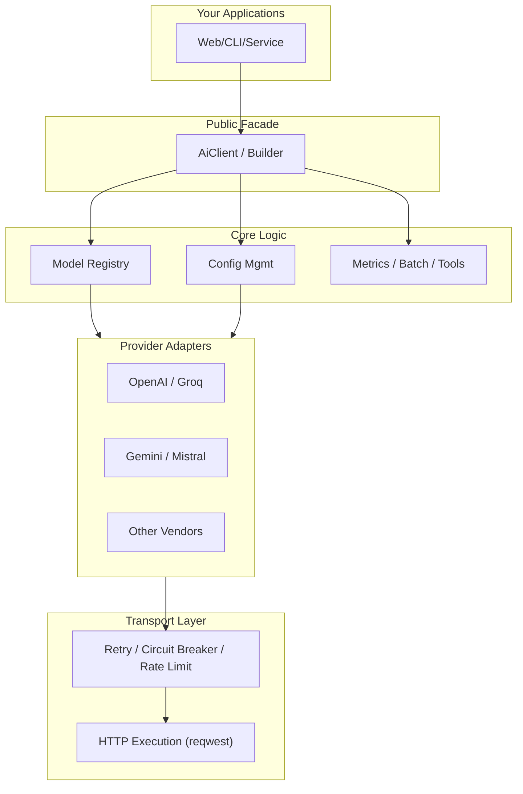

# Architecture

ai-lib follows a layered architecture that separates concerns and enables extensibility. This design allows for easy provider integration, reliability features, and custom transport implementations.

## High-Level Architecture



## Module Structure

| Layer | Module(s) | Responsibility |
|-------|-----------|----------------|
| **Public Facade** | `AiClient`, `AiClientBuilder`, `Provider` | Entry points & configuration |
| **Domain Types** | `types::request`, `types::response`, `types::common` | Messages, roles, content enums |
| **API Traits** | `api::chat` | Chat abstractions + streaming chunk types |
| **Provider Adapters** | `provider::*` | Provider-specific implementations |
| **Model Management** | `provider::models`, `provider::configs` | Capability metadata, selection strategies |
| **Reliability** | `circuit_breaker`, `rate_limiter`, `error_handling` | Retry, fallback, circuit breaker, rate limiting |
| **Transport** | `transport::*` | HTTP execution, proxy, abstraction |
| **Metrics** | `metrics` | Extensible instrumentation |
| **Utilities** | `utils::file` | File helpers for multimodal content |

## Core Components

### 1. AiClient & Builder

The main entry point for all AI operations:

```rust
use ai_lib::{AiClient, Provider, ConnectionOptions};

// Simple usage
let client = AiClient::new(Provider::Groq)?;

// Advanced configuration
let client = AiClient::with_options(
    Provider::OpenAI,
    ConnectionOptions {
        proxy: Some("http://proxy:8080".into()),
        timeout: Some(Duration::from_secs(30)),
        ..Default::default()
    }
)?;
```

### 2. Provider Adapters

All providers now implement the `ChatProvider` trait for consistent behavior:

**Generic Adapters** (Config-driven):
- Unified configuration system for OpenAI-compatible providers
- Automatic API key detection and model resolution
- Consistent error handling and retry logic

**Independent Adapters** (Custom logic):
- Provider-specific optimizations and features
- Advanced capabilities like function calling and streaming
- Direct integration with provider APIs

### 3. Transport Layer

High-performance HTTP transport with direct client integration:

```rust
use ai_lib::transport::{HttpTransport, DynHttpTransport};

// Built-in transport with retry and proxy support
let transport = HttpTransport::new()?;

// Custom transport implementation
let transport = CustomTransport::new();
```

**Performance Optimizations:**
- Direct `reqwest::Client` integration for optimal performance
- Unified proxy support via `AI_PROXY_URL` environment variable
- Efficient JSON serialization using native reqwest methods
- Minimal abstraction overhead for maximum throughput

### 4. Reliability Features

Built-in reliability primitives:

- **Circuit Breaker**: Automatic failure detection
- **Rate Limiting**: Token bucket algorithm
- **Retry Logic**: Exponential backoff with jitter
- **Error Classification**: Retryable vs permanent errors

### 5. Model Management

Advanced model selection and load balancing:

```rust
use ai_lib::{ModelArray, LoadBalancingStrategy, ModelSelectionStrategy};

let array = ModelArray::new("production")
    .with_strategy(LoadBalancingStrategy::HealthBased)
    .add_endpoint(ModelEndpoint {
        name: "groq-1".into(),
        url: "https://api.groq.com".into(),
        weight: 1.0,
        healthy: true,
    });
```

## Data Flow

### Basic Chat Request

1. **Request Creation**: `ChatCompletionRequest` with messages and options
2. **Provider Selection**: Choose adapter based on `Provider` enum
3. **Request Transformation**: Convert to provider-specific format
4. **Transport Execution**: Send HTTP request with retry logic
5. **Response Parsing**: Parse provider response into unified format
6. **Error Handling**: Classify and handle errors appropriately

### Streaming Request

1. **Stream Initialization**: Create streaming connection
2. **Chunk Processing**: Parse SSE chunks as they arrive
3. **Delta Aggregation**: Combine deltas into complete responses
4. **Error Recovery**: Handle stream interruptions gracefully

### Function Calling

1. **Tool Definition**: Define tools with JSON schemas
2. **Request Enhancement**: Add tools to chat request
3. **Response Analysis**: Detect function call intentions
4. **Tool Execution**: Execute external functions
5. **Result Integration**: Feed results back to model

## Design Principles

1. **Unified Interface**: Same API across all providers
2. **Progressive Complexity**: Start simple, add features as needed
3. **Extensibility**: Pluggable transport, metrics, and strategies
4. **Reliability**: Built-in retry, circuit breaker, and error handling
5. **Performance**: Direct HTTP client integration, minimal abstraction overhead
6. **Type Safety**: Strong typing throughout the API

## Next Steps

- Explore [Provider Details](/docs/providers) for specific implementations
- Learn about [Reliability Features](/docs/reliability-overview) for production use
- Check [Advanced Examples](/docs/advanced-examples) for complex patterns
