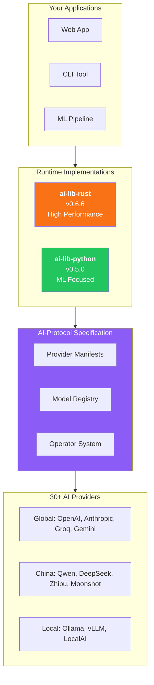
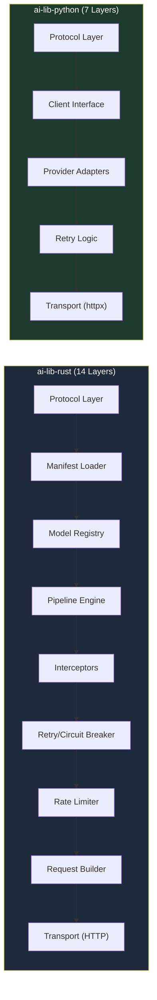
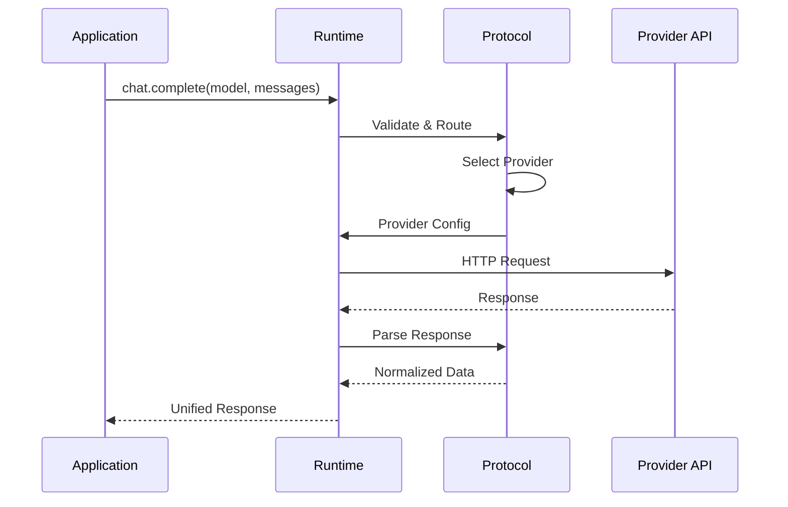

# AI-Protocol Ecosystem Architecture

This document provides visual architecture diagrams and detailed explanations of how the AI-Protocol ecosystem components interact.

## Ecosystem Overview

## Runtime Architecture Comparison

## Request Flow

## Provider Support Matrix

| Category | Providers | Status |
|----------|-----------|--------|
| **Global Tier 1** | OpenAI, Anthropic, Gemini | ✅ Full |
| **Global Tier 2** | Groq, Mistral, Cohere, Perplexity | ✅ Full |
| **China Region** | Qwen, DeepSeek, Zhipu, Moonshot | ✅ Full |
| **Self-Hosted** | Ollama, vLLM, LocalAI | ✅ Full |
| **Specialized** | Together, Fireworks, DeepInfra | ✅ Full |

## Key Design Principles

### 1. Protocol-First
All behavior is defined by the protocol specification, not hard-coded in runtimes.

### 2. Zero Lock-In
Switch providers without code changes - just update configuration.

### 3. Type Safety
Both runtimes provide strong typing:
- **Rust**: Compile-time guarantees
- **Python**: Pydantic v2 runtime validation

### 4. Performance
- **Rust**: <1ms overhead, zero-copy parsing
- **Python**: Async-first, connection pooling

## Getting Started

Choose your path:

- 🦀 **Rust developers**: [Get Started with ai-lib-rust](/rust/quick-start/)
- 🐍 **Python developers**: [Get Started with ai-lib-python](/python/quick-start/)
- 📋 **Protocol implementers**: [View AI-Protocol Spec](/protocol/)
