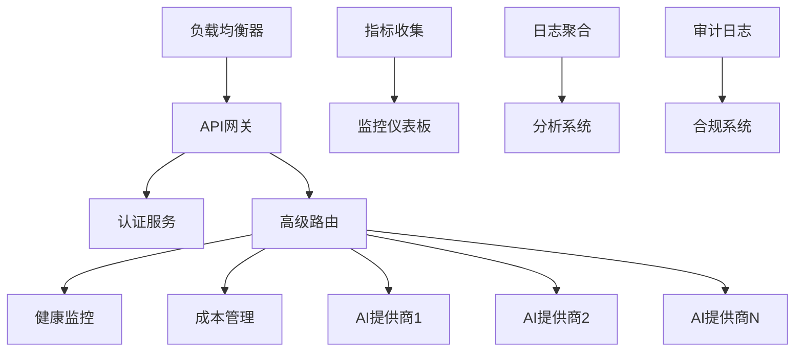

# ai-lib-pro 企业级功能

ai-lib-pro 是 ai-lib 的商业企业版本，为生产环境、大规模部署和企业需求提供高级功能。构建在开源 ai-lib 核心之上，提供无缝升级路径，无需破坏性更改。

## 为什么选择 ai-lib-pro？

虽然 ai-lib 提供了优秀的基础功能，但企业环境通常需要：

- **智能路由和负载均衡** 具备多维度评分以实现最优性能
- **实时监控和仪表板** 提供实时系统指标和用户分析
- **全面的可观测性** 包括结构化事件日志和分布式追踪
- **企业级安全** 具备上下文感知的RBAC、审计跟踪和合规框架
- **高级成本管理** 实现实时计算、预算执行和优化
- **热配置管理** 支持零停机更新和密钥轮换
- **用户管理** 多租户配额执行和使用跟踪

## 核心企业功能

### 🚀 高级模型管理与路由

**智能负载均衡**
- 多维度评分算法，综合考虑健康状态、延迟、成本和错误率
- 基于实时反馈和历史数据分析的性能路由
- 粘性会话保持用户上下文和一致性
- 基于负载模式和成本优化的动态模型扩展和选择

**健康监控与仪表板集成**
- 具备可配置策略的全面健康检查端点
- 智能冷却期和错误率阈值的自动故障转移
- P95延迟跟踪和成本效率指标的实时性能监控
- 提供系统指标、用户分析和模型性能数据的实时仪表板API

> 注：开源版 ai-lib 提供 `RoutingStrategyBuilder` + `FailoverProvider` 组合的基础策略（在可重试错误出现时按顺序切换）。高级带权/成本、SLO 感知策略由 ai-lib-pro 提供。

```rust
use ai_lib_pro::{AdvancedRouter, RoutingPolicy, HealthMonitor};

let router = AdvancedRouter::new()
    .with_policy(RoutingPolicy::PerformanceBased)
    .with_health_monitor(HealthMonitor::new())
    .with_sticky_sessions(true)
    .build()?;
```

```rust
/// Open-source ai-lib (OSS) 策略化故障转移示例
use ai_lib::provider::{RoutingStrategyBuilder, GroqBuilder, AnthropicBuilder, OpenAiBuilder};

let strategy = RoutingStrategyBuilder::new()
    .with_provider(GroqBuilder::new().build_provider()?)
    .with_provider(AnthropicBuilder::new().build_provider()?)
    .build_failover()?;

let client = OpenAiBuilder::new()
    .with_strategy(Box::new(strategy))
    .build()?;
// 当 OpenAI 出现网络/超时/限流/5xx 时，将按顺序尝试 Groq → Anthropic。
```

### 📊 增强的可观测性与监控

**高级指标**
- 自定义指标和百分位数
- 详细的性能跟踪
- 业务特定KPI
- 实时仪表板

**分布式追踪**
- 跨服务边界的完整请求追踪
- 与OpenTelemetry和Jaeger集成
- 性能瓶颈识别
- 跨服务依赖映射

**结构化日志**
- 带上下文的JSON格式日志
- 日志聚合和分析
- 可配置的日志级别和过滤
- 与ELK堆栈集成

```rust
use ai_lib_pro::{EnterpriseMetrics, TracingConfig};

let metrics = EnterpriseMetrics::new()
    .with_custom_metrics(true)
    .with_percentiles(vec![50.0, 95.0, 99.0])
    .with_tracing(TracingConfig::jaeger())
    .build()?;
```

### 🔒 企业安全与合规

**高级身份验证**
- OAuth2、SAML、LDAP集成
- 多因素身份验证支持
- 单点登录(SSO)功能
- 基于令牌的身份验证和刷新

**基于角色的访问控制(RBAC)**
- 细粒度权限管理
- 资源级访问控制
- 动态角色分配
- 所有访问决策的审计跟踪

**合规功能**
- SOC2、GDPR、HIPAA合规工具
- 静态和传输中数据加密
- PII检测和脱敏
- 全面的审计日志

```rust
use ai_lib_pro::{SecurityManager, RBACPolicy, ComplianceConfig};

let security = SecurityManager::new()
    .with_rbac(RBACPolicy::new())
    .with_compliance(ComplianceConfig::gdpr())
    .with_encryption(true)
    .build()?;
```

### 💰 高级定价与成本管理

**动态定价模型**
- 基于使用、分层和自定义定价
- 实时成本计算
- 预算控制和支出警报
- 多租户计费分离

**成本分析**
- 按提供商/模型的详细成本分解
- 成本优化建议
- 使用模式分析
- 预测性成本建模

**预算管理**
- 支出限制和警报
- 按部门/项目的成本分配
- 自动化成本报告
- 与企业计费系统集成

```rust
use ai_lib_pro::{CostManager, BudgetConfig, PricingCatalog};

let cost_mgr = CostManager::new()
    .with_pricing_catalog(PricingCatalog::latest())
    .with_budget_config(BudgetConfig::new()
        .monthly_limit(10000.0)
        .alert_threshold(0.8)
        .build())
    .build()?;
```

### ⚙️ 高级配置管理

**热配置重载**
- 零停机配置更新
- 环境特定配置
- 配置验证和回滚
- 配置变更的A/B测试

**密钥管理**
- 与企业密钥存储集成(HashiCorp Vault、AWS Secrets Manager)
- 自动密钥轮换
- 安全密钥分发
- 密钥访问审计跟踪

```rust
use ai_lib_pro::{ConfigManager, SecretStore, HotReload};

let config_mgr = ConfigManager::new()
    .with_hot_reload(HotReload::enabled())
    .with_secret_store(SecretStore::vault())
    .with_validation(true)
    .build()?;
```

### 🔧 高级开发功能

**增强的函数调用**
- 带版本控制的功能注册表
- 功能组合和工作流
- 自动化测试和验证
- 功能分析和监控

**高级流式处理**
- WebSocket支持实时通信
- 流分析和处理
- 流持久化和重放
- 自定义流协议

**企业集成**
- API网关集成(Kong、Istio)
- 服务网格支持
- 遗留系统连接器
- 自定义协议支持

## 功能对比

| 功能 | ai-lib (开源) | ai-lib-pro |
|------|---------------|------------|
| **路由** | ✅ 轮询、基于健康 | ✅ 多维度评分、粘性会话 |
| **仪表板与分析** | ❌ | ✅ 实时仪表板API、结构化事件 |
| **可观测性** | ✅ 基础指标接口 | ✅ 高级分析、分布式追踪 |
| **安全性** | ✅ API密钥管理 | ✅ 上下文感知RBAC、SSO、审计 |
| **成本管理** | ✅ 基础成本跟踪 | ✅ 实时计算、预算执行 |
| **用户管理** | ❌ | ✅ 多租户配额、使用跟踪 |
| **配置管理** | ✅ 环境变量 | ✅ 热重载、密钥轮换、验证 |
| **健康监控** | ✅ 基础健康检查 | ✅ 高级监控、告警管理 |
| **企业集成** | ❌ | ✅ API网关、服务网格、遗留系统 |

## 开发状态与可用性

### 当前开发阶段

**ai-lib-pro 核心基础设施现已可用**，包含基础企业功能：智能路由、实时仪表板API、用户管理、成本追踪和高级安全。我们持续基于企业客户反馈和新兴需求扩展功能。

### 企业部署计划

我们为对 ai-lib-pro 感兴趣的企业提供部署协助：

- **集成规划**：详细规划 ai-lib-pro 与您现有基础设施的集成
- **功能配置**：指导为您的特定用例配置企业功能
- **生产部署**：支持试点和生产部署
- **持续合作**：持续反馈和增强协作

### 参与方式

如果您对 ai-lib-pro 企业功能感兴趣：

1. **联系我们**：通过我们的[联系表单](/zh/contact)讨论您的部署需求
2. **集成评估**：我们将评估您当前的基础设施和 ai-lib-pro 集成机会
3. **功能配置**：我们将帮助为您的特定需求配置可用的企业功能
4. **部署支持**：我们将为试点和生产部署提供指导
5. **增强合作**：探索定制企业功能开发的机会

### 实施方法

ai-lib-pro 设计为 ai-lib 的直接替代品：

1. **无代码更改**：现有 ai-lib 代码无需修改即可工作
2. **渐进式迁移**：企业功能可以逐步启用
3. **向后兼容**：与 ai-lib API 完全兼容
4. **性能增强**：企业优化带来性能提升

## 企业支持与合作

### 服务层级（示例）

| 服务层级 | 目标客户 | 服务内容 | 收费模式 |
|---|---|---|---|
| 基础支持层 | 小型团队，需要基础保障 | 社区问题优先解答；文档和最佳实践访问；一般性版本更新通知 | 年费订阅 |
| 专业支持层 | 成长型公司，需要深度支持 | 专属沟通渠道（Slack/Teams）；紧急 Bug 修复；配置与代码审查；部署架构咨询 | 年费订阅（更高价格） |
| 企业护航层 | 大型客户，要求全面托管和 SLA | 专人技术客户经理；SLA（如 99.9%）；主动性能监控与告警；定制功能开发 | 年度合同（定制报价） |

> 提示：支持服务的目标是“减轻客户运维负担”。我们提供紧急响应、版本升级与安全补丁、性能调优与架构咨询，帮助团队在保留技术自主权的同时，避免“完全自建”的运维风险。

### 当前支持选项

- **需求讨论**：详细评估您的企业AI基础设施需求
- **架构咨询**：审查和建议您当前的设置
- **定制开发规划**：协作规划企业特定功能
- **企业部署协助**：ai-lib-pro 集成和配置支持
- **技术咨询**：最佳实践和优化策略指导

### 合作机会

我们正在积极寻找企业合作伙伴来：

- **功能增强**：影响 ai-lib-pro 功能优先级和发展方向
- **试点项目**：企业功能的部署测试和反馈
- **定制开发**：企业特定能力的协作开发
- **案例研究**：记录成功的实施和最佳实践

## 企业级部署架构

### 高可用性设计



### 安全架构

- **网络隔离**：VPC和防火墙配置
- **访问控制**：多层身份验证和授权
- **数据保护**：端到端加密和脱敏
- **合规监控**：实时合规检查和报告

## 下一步

- **联系我们**：使用我们的[联系表单](/zh/contact)讨论您的企业需求
- **需求评估**：我们将评估您的需求并提供建议
- **增强合作**：探索 ai-lib-pro 功能增强的合作机会
- **部署支持**：获得 ai-lib-pro 部署和配置支持

---

**准备好部署企业级AI基础设施？** 联系我们讨论您的需求，获得 ai-lib-pro 部署支持和功能增强合作机会。
